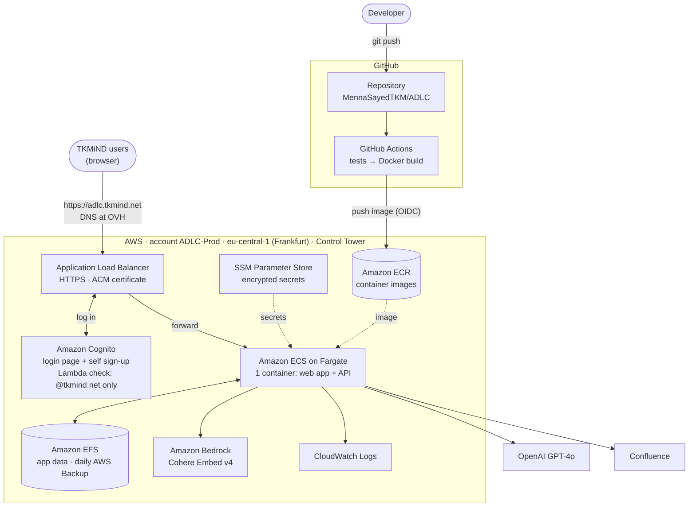
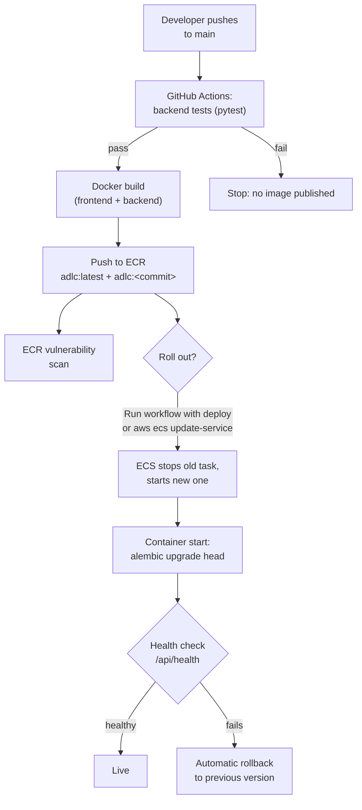
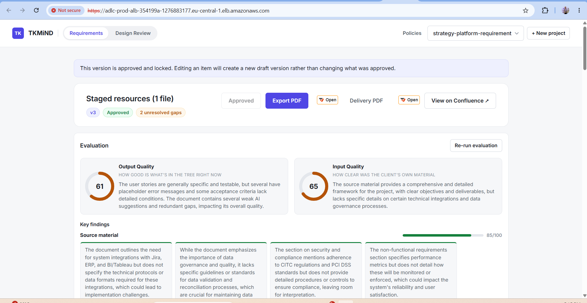

# ADLC: Deployment and Architecture

**What it is:** ADLC (TKMiND SDLC platform) is an internal tool for project
teams. It extracts structured requirements from client documents, lets the
PM review and approve them, and checks design screens against the approved
requirements.

| | |
|---|---|
| **Website** | https://adlc.tkmind.net *(once the DNS records are added at OVH)*. Until then: https://adlc-prod-alb-354199a-1276883177.eu-central-1.elb.amazonaws.com |
| **Access** | Sign up on the login page with an `@tkmind.net` email; other domains are refused |
| **Source code** | https://github.com/MennaSayedTKM/ADLC (private) |
| **AWS account** | ADLC-Prod (`958295070544`), region Europe (Frankfurt) `eu-central-1`, managed by AWS Control Tower |
| **AWS console** | https://d-9067c485f3.awsapps.com/start → ADLC-Prod → AWSAdministratorAccess |
| **Infrastructure as code** | `infra/` in the repository (Pulumi, Python) |

---

## 1. Architecture



**Network and security details** (not drawn): VPC `10.40.0.0/16` with two
public subnets and no NAT gateway. The load balancer accepts HTTPS from the
internet; the container accepts traffic only from the load balancer (port
8080); EFS accepts traffic only from the container (NFS, encrypted in
transit).

**How a request flows:** the browser goes to the Application Load Balancer.
The load balancer sends anyone not logged in to the Cognito login page, then
forwards the request to the single Fargate container. The container serves
the web app and the API (`/api/*`). It reads and writes its data on EFS and
calls Bedrock (embeddings), OpenAI (AI analysis) and Confluence (publishing).

**Security at a glance:**
- Only the load balancer accepts traffic from the internet. The container
  accepts traffic only from the load balancer, and EFS only from the
  container. There are no servers to log into and no SSH.
- No passwords or keys are stored in code, in the image or in GitHub.
  Secrets are in SSM Parameter Store, encrypted, and injected at start-up.
  GitHub signs in to AWS with a short-lived OIDC token restricted to the
  `main` branch of this repository.
- Only `@tkmind.net` addresses can create an account; a Lambda function
  checks every sign-up.
- The data store (EFS) and the image repository (ECR) are encrypted. EFS is
  backed up daily, and images are scanned for vulnerabilities on every push.

---

## 2. Deployment process



### 2.1 Application changes (the everyday case)
1. **Push to `main`.** GitHub Actions (`.github/workflows/docker-publish.yml`)
   runs all backend tests. Only if they pass does it build the Docker image
   and push it to ECR as `adlc:latest` and `adlc:<commit sha>`. This takes
   about 3–8 minutes. Changes only under `infra/`, `docs/` or `*.md` don't
   trigger a build.
2. **Roll it out**, in either of two ways:
   - **GitHub:** Actions → *Build and push image* → **Run workflow**, with
     **deploy** ticked.
   - **Terminal:**
     ```
     aws sso login --profile adlc
     aws ecs update-service --cluster adlc-prod --service adlc-prod-app --force-new-deployment --profile adlc
     ```
3. ECS stops the running container and starts the new one. The site is
   unavailable for about **1–2 minutes**; only one container may ever write
   to the database. On start-up, the container applies any database
   migrations. If the new version doesn't pass its health check, ECS rolls
   back automatically.

### 2.2 Infrastructure changes
All AWS resources are defined in `infra/` with Pulumi. To change anything
(sizes, settings, new resources):
```
cd infra
aws sso login --profile adlc
pulumi preview      # shows exactly what would change; nothing is applied
pulumi up           # applies it
```
Every change is reviewed with `pulumi preview` first. The offline tests
(`venv\Scripts\python -m pytest tests`) check the security-relevant wiring
without needing AWS.

### 2.3 Day-to-day operations
| Task | How |
|---|---|
| View logs | `aws logs tail /ecs/adlc-prod --follow --profile adlc` |
| Check health | AWS console → ECS → cluster `adlc-prod` → service `adlc-prod-app` |
| New user | Self-service **Sign up** with an `@tkmind.net` email (the code email may land in Junk) |
| Remove a user | `aws cognito-idp admin-delete-user --user-pool-id eu-central-1_14ALZjxTL --username NAME@tkmind.net --profile adlc` |
| Rotate the OpenAI key | `pulumi config set --secret adlc:openaiApiKey`, then `pulumi up`, then redeploy |
| Restore data | AWS Backup → Protected resources → the EFS file system → Restore |

---

## 3. Tools and services used, and why

| Tool / service | Used for | Why this choice |
|---|---|---|
| **AWS Control Tower** (member account *ADLC-Prod*) | A dedicated, governed AWS account | Isolates ADLC from other projects; company guardrails and audit logging apply automatically |
| **AWS IAM Identity Center** (SSO) | Human access to AWS (console and CLI) | Personal logins with MFA and temporary credentials; no long-lived access keys |
| **Pulumi** (Python) | Infrastructure as code (`infra/`) | Every resource is versioned and reviewable (`pulumi preview`); same language as the backend; testable offline. State is stored in S3 in the ADLC account and encrypted with KMS |
| **GitHub + GitHub Actions** | Source code, tests and image builds | Tests gate every image; builds run on each push. Free within GitHub's monthly minutes |
| **Docker** | Packaging the app | One image with backend and frontend; identical wherever it runs |
| **Amazon ECR** | Private image registry | Inside the company's AWS account; no registry tokens to manage (ECS pulls with its AWS role); built-in vulnerability scanning; about $0.10/month |
| **Amazon ECS on AWS Fargate** | Running the container | Serverless containers: no servers to patch or maintain; automatic restarts and rollbacks |
| **Amazon EFS** | Persistent data (`data/`: SQLite database, FAISS index, tiles, uploads) | Fargate containers have no permanent disk. EFS is encrypted, survives redeploys, and is backed up daily by AWS Backup |
| **Application Load Balancer** | HTTPS entry point | TLS termination, HTTP→HTTPS redirect, health checks, and built-in login through Cognito |
| **Amazon Cognito** | Login page and self sign-up | Managed users, passwords, email verification and password reset, with no login code in the app |
| **AWS Lambda** | Pre sign-up check | Rejects any email outside `@tkmind.net` (the app has no per-user permissions, so access must be company-only) |
| **AWS Certificate Manager** | TLS certificate for `adlc.tkmind.net` | Free, renews automatically |
| **SSM Parameter Store + AWS KMS** | Secrets (OpenAI key, Confluence token) | Encrypted, access-controlled, injected into the container at start-up |
| **Amazon Bedrock: Cohere Embed v4** | Embeddings for design screens (visual search index) | Managed and pay-per-use (fractions of a cent per screen); replaced a GPU server that would cost about $150/month |
| **Amazon CloudWatch Logs** | Container and Lambda logs | Central logs, kept 30 days |
| **AWS Backup** | Daily EFS backups, kept 35 days | Point-in-time restore of all app data |
| **OVH DNS** | `tkmind.net` domain | Where the company domain is already hosted; one CNAME points `adlc.tkmind.net` at AWS |
| **OpenAI GPT-4o** | Requirements extraction, evaluation, design alignment | The app's AI engine (existing); usage and cost are logged per call in the `ai_calls` table |

---

## 4. Estimated monthly cost

Region eu-central-1, on-demand prices, as of September 2026. These are
estimates; actual costs are visible in **AWS Billing → Cost Explorer**
(all resources are tagged `Project = ADLC`).

| Item | Running 24/7 | Work hours only* |
|---|---:|---:|
| ECS Fargate: 1 vCPU / 4 GB, 1 task | $49 | $16 |
| Application Load Balancer | $22 | $22 |
| Public IPv4 addresses (load balancer + container) | $11 | $8 |
| EFS + AWS Backup (data currently about 1 MB) | < $1 | < $1 |
| ECR, CloudWatch Logs, KMS, S3 (Pulumi state), SSM | ~ $2 | ~ $2 |
| Cognito (free up to 10,000 monthly users), Lambda, ACM | $0 | $0 |
| Old EC2 data disk + snapshots (kept as backup until deleted) | $5 | $5 |
| **AWS total** | **≈ $90** | **≈ $55** |

*Optional: the container can run only Mon–Fri 08:00–19:00 Dubai time
(`adlc:appScheduleEnabled`), with the site unavailable outside those hours.

**Usage-based, on top:**
- **Amazon Bedrock embeddings:** $0.12 per 1M tokens, about $0.0005 per design screen.
- **OpenAI GPT-4o:** billed by OpenAI per request; each call's tokens and
  estimated cost are logged in the app's `ai_calls` table.
- **GitHub Actions:** free within the monthly minutes of the GitHub plan (a build takes about 3–8 minutes).

**Compared with the first deployment:** EC2 app server plus a GPU embedding
server, about $110–260/month depending on GPU hours. Moving to Fargate and
Bedrock removed all servers and the GPU.

---

## 5. Screenshots

**Requirements review** (approved version, evaluation):



---

## 6. History and decisions

| Date | Change |
|---|---|
| 2026-09-24 | ADLC-Prod account created with Control Tower (OU `ADLC`); first deployment on EC2 |
| 2026-09-28 | Embeddings moved from a self-hosted GPU (Qwen3-VL) to Amazon Bedrock (Cohere Embed v4) |
| 2026-09-28 | Moved from EC2 to ECS Fargate + EFS; image built by GitHub Actions and stored in ECR; EC2 server removed |
| 2026-09-29 | Self sign-up for `@tkmind.net`; certificate requested for `adlc.tkmind.net` (DNS records pending at OVH) |

**Open items:**
- Add the two DNS records at OVH, then switch the site to `https://adlc.tkmind.net`.
- "Sign in with Microsoft" is prepared but not enabled. It needs an app
  registration in Microsoft Entra ID by a Microsoft 365 admin.
- Delete the old EC2 data disk and its snapshots once they're no longer
  needed as a backup (about $5/month).
